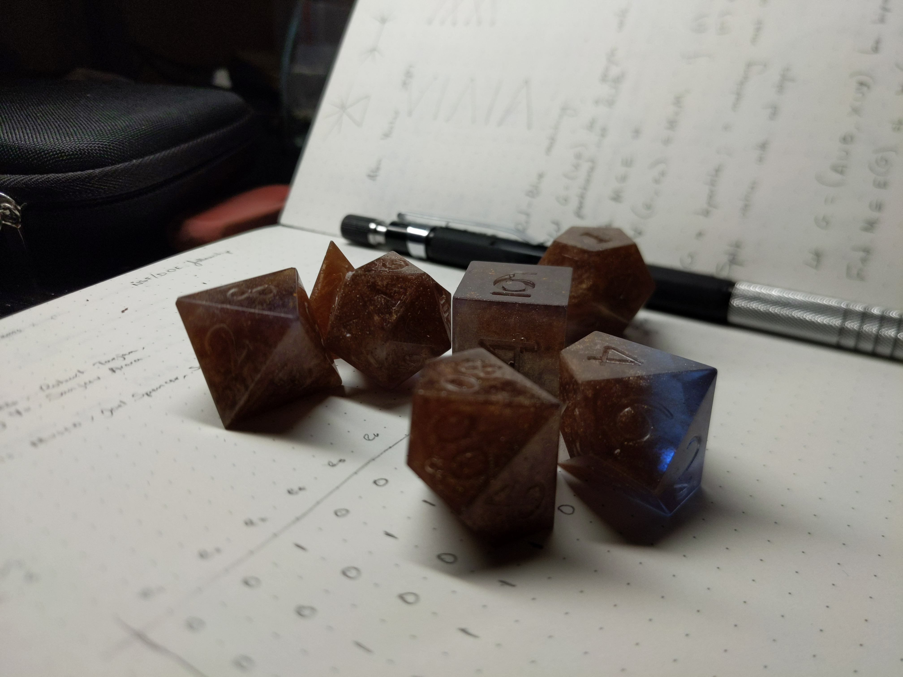

***

These dice are cast in two-part artists's epoxy. It is hard to see here, but
the epoxy is colored blue. Bronze and iridescent blue mica powder are added as
inclusions. The numbers were left unpainted for a while, but I later filled
them in with Testors enamel paint in sea blue.

The intention was to have mostly blue dice with some bronze streaks, but
clearly, the bronze mica dominates the colors of these dice. I still like them
though.
