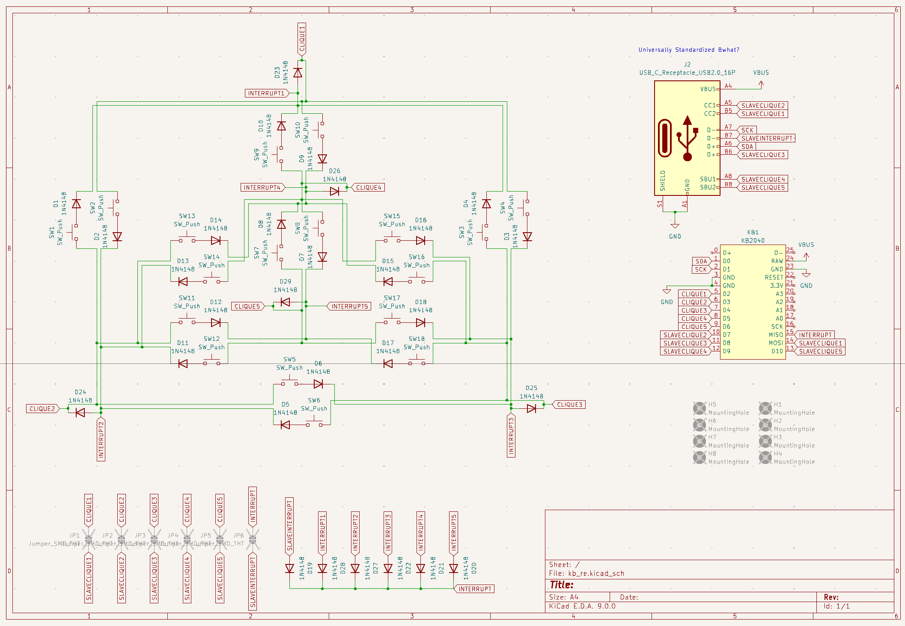
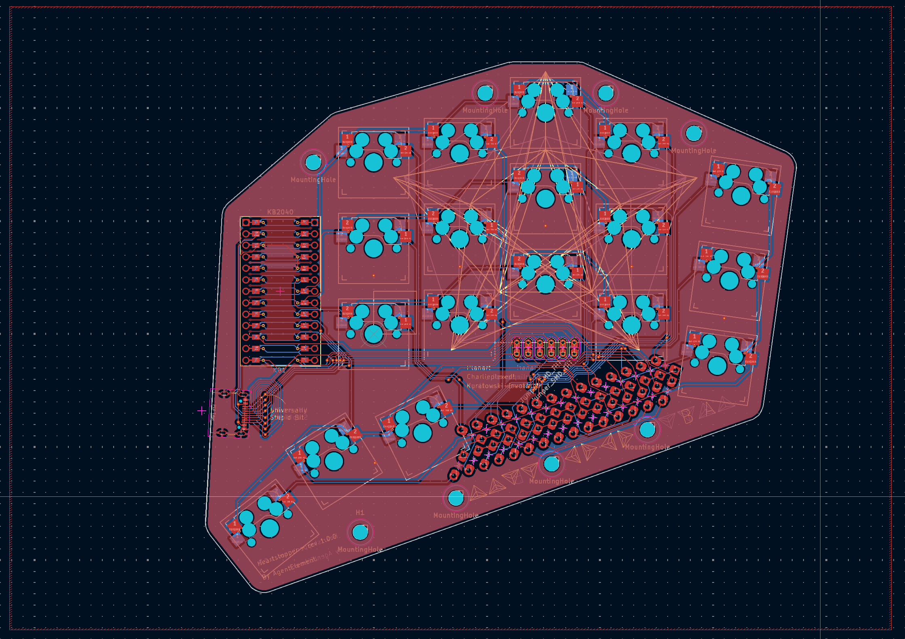

Heartstopper is a small 36-key split keyboard built with the goal of reducing
finger movement beyond the home row. A secondary goal is to minimize pinky
strain, achieved by a small splay on the pinky finger column. The name of this
keyboard comes from the shape of the top plate: It looks like half a heart!

***

## Unintentional math

While routing Heartstopper's PCB, I discovered an interesting result in
structural graph theory. The result emerged while routing the matrix for the
keyboard, which uses a multiplexing topology called Charlieplexing.
Charlieplexing is a type of multiplexing that requires as few GPIO pins as
possible, but a naive Charlieplexed layout comes with a power-inefficient
drawback: It requires the circuit to constantly poll every switch in the
keyboard. I originally designed Heartstopper with this naive implementation,
and as I routed the traces on the PCB, I found that the underlying graph of
Heartstopper's particular matrix was planar. Thus the traces could be routed on
only one side of the board, without crossing each other.

Although the possibility of a single-sided routing was pleasing, I wanted to
redesign the board to use a less naive implementation with additional interrupt
lines. This new implementation cost an additional GPIO pin on the
microcontroller, but it allowed for a more power efficient circuit, as the
microcontroller only needs to poll the matrix when the interrupt lines are
triggered. As I routed the traces of this new circuit, I found that the circuit
could no longer be routed on a single-sided PCB (i.e. the circuit was not
planar).

Thus a natural question emerged: Suppose you could route a naively
implemented charlieplexed circuit on a single-sided PCB. Then, is it ever
possible to route the corresponding power-saving circuit with interrupt lines
on a single-sided PCB? If yes, then for which classes of naive circuits can the
corresponding power-saving circuit be routed on a single-sided PCB?

In graph-theoretic terms, let G be some graph. The vertices of this graph
represent pins of a microcontroller, and the edges are pairs of diodes and
switches in series. Then, let S(G) be a transformation of this graph, which
corresponds to the addition of the interrupt lines. To transform G into S(G),
for each vertex v in G, add a new vertex v', which represents an interrupt
line. Then connect v' to v and all original neighbors of v in G. For which G is
S(G) planar? I prove in [this paper](https://arxiv.org/abs/2505.09534) that
S(G) is planar if and only if G is a bipartite cactus graph -- the set of
graphs where all cycles are of even order, and where no two cycles share an
edge.

***

## Additional notes on construction

Although the math behind the routing was substantial enough to warrant a paper,
the hardware itself is kept simple. Heartstopper is wired-only. It uses the
Adafruit KB2040, a low-cost Arduino Pro Micro compatible MCU with the RP2040
chip. I use the I2C pins on the STEMMA QT connector on the KB2040 to connect
the two halves. Most similar keyboards use an external TRRS connector for
communication between their two halves, but the TRRS connector is not suited
for this purpose, as it momentarily shorts its connections, possibly frying the
microcontroller it is connected to in the process. The STEMMA QT uses a JST SH
connector, which slides in without the contacts dragging across each other,
eliminating the risk of shorts (albeit at the cost of a more fragile connector
rated for fewer mating cycles).

Because the matrix is Charlieplexed, each half only requires six GPIO pins on
the microcontroller: 5 for the matrix plus one pin for an interrupt line.
Strictly speaking, Charlieplexing is not required for this project -- a
brain-dead 4x5 matrix requires 9 pins, and the KB2040 has 20. And although
wired-only, I use ZMK for firmware, a wireless-first project. ZMK had a
charlieplex driver already written, and someone had hacked together enough
support for wired builds that ZMK was usable. In this sense, the keyboard is
spectacularly over-engineered. I did not need to Charlieplex a 18-key matrix on a
20-pin MCU, thereby requiring me to use wired ZMK just for its driver. But
sometimes, one does things just for the heck of it.

Only 1u keycaps are required for the build, but you may substitute a 1.5u
keycap for the central thumb key. I use a 3d-printed set of rounded keycaps for
the thumb keys (not pictured above). The physical design is a 3-layer sandwich,
designed to be easily printable: A PLA top plate to hold the keys, a PCB with
hotswap sockets to carry full-size MX-profile switches in between, and a TPU
bottom gasket. The top plate and PCB are separated by TPU spacers. I enjoy
clicky switches, so I use Kailh's Box Jade switches, but any MX fits.

All 3-D printed parts are designed with OpenSCAD. The layout is designed with
Ergogen. All files are available on Github
[here](https://github.com/AgentElement/heartstopper).

***

## Pictures

A picture of the board. The graph on the silkscreen is S(G), where G is the
clique on five vertices, minus one edge (K_5 - e).

The schematic. The matrix is laid out to approximately mirror the unique planar
drawing of K_5 - e.

A routing of the board. Note the diode run near the bottom. I added it because
it was pretty.

***

*Note: A few pictures of this project were posted to this page on 2025-06-03.*

