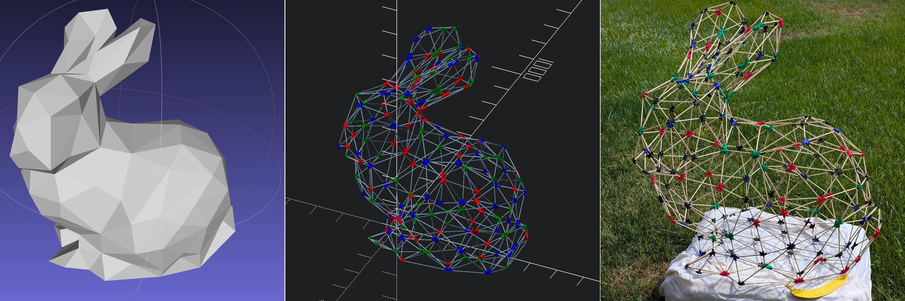

I maintain a few pieces of open-source software.

***

`VertexPrint` is a program that converts meshes and graph embeddings into
giant wireframe models. The models are comprised of 3d printed joint pieces
and laser-cut edges that the user must assemble into the desired structure.

git: https://github.com/AgentElement/vertexprint

***

`assembly-theory` is a command line program and a rust/python library. It
computes a graph-theoretic measure of molecular complexity called the assembly
index. A paper can be found [here](https://doi.org/10.21105/joss.09318)

git: https://github.com/DaymudeLab/assembly-theory.

***

`functional-supercollider` is a very fast lambda calculus reduction machine,
designed to reduce millions of lambda calculus expressions in parallel. I use
it to run large genetic simulations on the Sol HPC cluster, to observe the
behavior of lambda expressions if they are treated as organisms in a
primodial soup.

git: https://github.com/AgentElement/functional-supercollider

